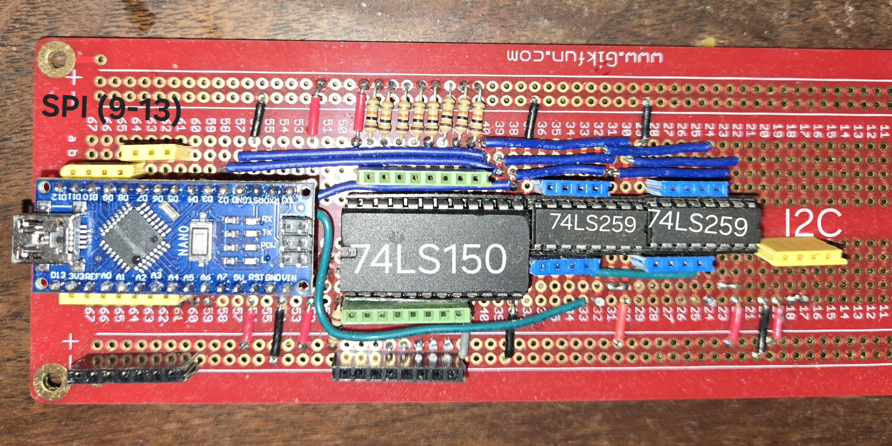

# Plexorino

Plexorino is a small Arduino library for expanding GPIO using classic TTL logic:

- **Input multiplexing** via  
  - 74LS151 (8-to-1)  
  - 74LS150 (16-to-1)
- **Output demultiplexing** via  
  - 74HC259 (8 outputs)  
  - two 74HC259 chips (16 outputs)

The library is intentionally **simple, explicit, and hardware-honest**:
no compile-time flags, no auto-initialization, no hidden resets.

---

## Key design principles

- **Runtime width selection** (8 or 16)
- **Two independent classes**
  - `PlexorinoMux` — inputs only
  - `PlexorinoDemux` — outputs only
- **Hardcoded pinout by design**
- **Explicit `begin()` required**
- **Shared address bus is driven only when needed**
  - Address lines are released to **high-Z (INPUT)** immediately after each operation
  - Prevents contention when mux and demux coexist
- **No bidirectional dependencies**
  - `write()` writes
  - `read()` reads
  - No hidden resets or auto-calls

---

## Hardware overview

### Supported chips

| Function | Chip | Width |
|-------|------|-------|
| Mux | 74LS151 | 8 |
| Mux | 74LS150 | 16 |
| Demux | 74HC259 | 8 |
| Demux | 2 × 74HC259 | 16 |

---

## Pinout (fixed)

### Shared address lines

| Arduino pin | Signal |
|-----------:|--------|
| D2 | ADDR0 |
| D3 | ADDR1 |
| D4 | ADDR2 |
| A1 | ADDR3 (mux drives in 16-bit mode only) |

> All address lines are released to INPUT (high-Z) when idle.

### Mux

| Arduino pin | Signal |
|-----------:|--------|
| A0 | MUX_DATA (read inverted) |

### Demux

| Arduino pin | Signal |
|-----------:|--------|
| D5 | DEMUX_DATA |
| A3 | LATCH0 (outputs 0–7) |
| A2 | LATCH1 (outputs 8–15, 16-bit only) |

---

## Installation

1. Copy the `Plexorino` folder into your Arduino `libraries/` directory  
2. Restart the Arduino IDE  
3. Include the header:

```cpp
#include <Plexorino.h>
```

## Usage

### Mux only (example: 8-bit)

```cpp
#include <Plexorino.h>

PlexorinoMux mux(PlexWidth::W8);

void setup() {
  mux.begin();
}

void loop() {
  for (uint8_t i = 0; i < mux.count(); i++) {
    bool v = mux.read(i);
    // use v
  }
}
```

### Demux only (example: 16-bit)

```cpp
#include <Plexorino.h>

PlexorinoDemux demux(PlexWidth::W16);

void setup() {
  demux.begin();
  demux.reset();
}

void loop() {
  demux.writeBits(0xFFFF);
  delay(300);
  demux.writeBits(0x0000);
  delay(300);
}
```

### Combined mux + demux (loopback)

```cpp
#include <Plexorino.h>

PlexorinoMux   mux(PlexWidth::W8);
PlexorinoDemux demux(PlexWidth::W8);

void setup() {
  mux.begin();
  demux.begin();
  demux.reset();
}

void loop() {
  for (muxAddr_t i = 0; i < mux.count(); i++) {
    demux.write(i, mux.read(i));
  }
}
```

## Address bus behavior

Address lines are shared.

Each read/write:
- Drives the required address bits
- Performs the operation
- Releases the address lines to INPUT (high-Z state)

This allows:
- mux and demux to coexist safely
- external circuitry to share the bus

## What Plexorino does not do
- No automatic initialization (call `begin()`)
- No implicit resets
- No background polling or timer abstraction


## Examples

- Mux-only usage (8 / 16)
- Demux-only usage (8 / 16)
- Full loopback tests (8×8, 16×16)
- Bit-pattern writes (`writeBits()`)

- 

